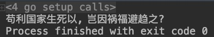

# MoHaScript
### 简介
这是一个暴力膜蛤脚本语言的实现
> - 换皮[Brainfxxk](https://github.com/topics/brainfuck)，对每个操作进行蛤化翻译
> - 使用Golang实现膜蛤大法，以其作为脚本的解释器

### 帮助
可使用 -h 命令行参数对MoHaScript的解释器参数说明进行打印，效果如下：
~~~
Usage of moha:
  -f string
    	放膜蛤脚本的路径是坠吼的！
  -h	长者的指点
~~~
可使用 -f <FILE_PATH> 命令,对膜蛤脚本的路径进行指定。

### 字符标识
仅支持八个命令：

| 标识 | 含义 | 
| :---: | :---: |
| ⌚ | 观察长者的时候，你的时间流逝会变快，所以你的⌚的"指针"，会前移 |
| 👓️ | 当你戴上👓时，会受到万民敬仰，你本体的时间会变慢，所以你的"指针"，会后移 |
| ➕ | 不要说话，➕1s |
| 📹️ | 香港记者的摄像机，Too young，too simple，会让你-1s |
| 🎸 | 当你弹起夏威夷吉他，长者的教导就会输入你的内心，你可以得到输入 |
| 🤓 | 看到这个表情，就如同见到了长者，这个表情在疯狂"输出"|
| 🧙 | 膜法师开始不断的吟唱咒语，开启了膜蛤新世界的大门 |
| 🐶 | 咒语的内容总是以🐶为标志，没有人知道为什么 |

### 例子
[输出膜法师的Slogan](demo/slogan.moha)

运行结果为：

### 下载
请在release中下载最新版本或编译安装